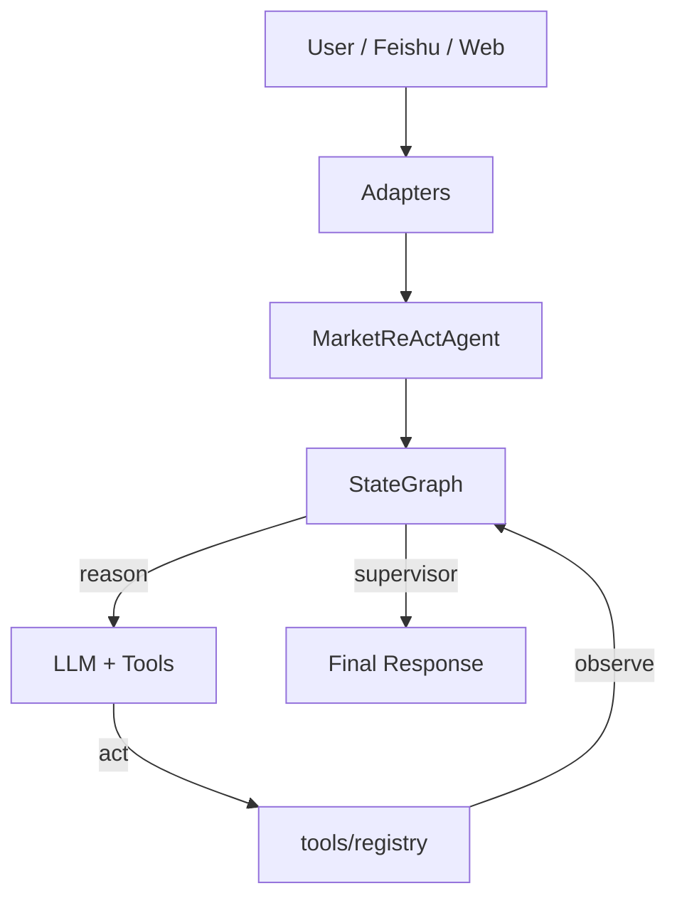

# MarketAssAgent — 独立 AI 行情分析 Agent

基于 LangGraph ReAct 架构的金融行情分析助手，支持加密货币、A股、美股、贵金属等多市场技术分析。

## 快速开始

### 1. 配置密钥

```bash
cp config/analysis_defaults.example.yaml config/analysis_defaults.yaml
# 编辑 config/analysis_defaults.yaml，填入 LLM API 密钥、飞书凭证等
```

或使用环境变量（见 `.env.example`）：

```bash
cp .env.example .env
# 编辑 .env，填入密钥
```

### 2. 安装依赖

```bash
python -m venv .venv
source .venv/bin/activate   # Linux/macOS
pip install -r requirements.txt
```

### 3. 运行

```bash
# 交互模式
python cli/run.py

# 单轮模式
python cli/run.py "BTC_USDT 行情分析"
```

### 4. VS Code 调试

在 VS Code 中打开 MarketAssAgent/ 目录，按 F5 即可启动 REPL 调试。

可选配置：
- `MarketAssAgent REPL` — 交互模式
- `MarketAssAgent 单轮` — 单次查询
- `行情分析 CLI` — 行情分析工具
- `飞书 Bot` — 飞书机器人

## 架构概览

MarketAssAgent 采用干净的 LangGraph ReAct 架构：



核心模块：
- `core/state.py`：AgentState + AnalysisSnapshot（TypedDict）
- `core/prompt.py`：ReAct 系统提示 + Few-shot
- `core/graph.py`：reason → act → observe → supervisor 节点
- `core/agent.py`：MarketReActAgent.invoke() 入口

## 项目结构（精简版）

```
MarketAssAgent/
├── core/            # LangGraph 核心（state, prompt, graph, agent）
├── tools/           # 工具注册与实现（market_data, sim_account, research）
├── memory/          # Snapshot 提取与持久化
├── persistence/     # PostgreSQL 交互
├── adapters/        # Feishu / Web 适配器
├── config/          # YAML 配置 + runtime_config
├── cli/             # 命令行入口
├── tests/
├── docs/
├── README.md
├── requirements.txt
└── pyproject.toml
```

## 核心配置

| 配置项 | 文件 | 说明 |
|--------|------|------|
| LLM 密钥 | `config/analysis_defaults.yaml` → `llm.providers` | API key、base_url、model |
| 飞书凭证 | 同上 → `feishu` | app_id、app_secret |
| 资产 catalog | `config/market_config.json` | symbol → provider 映射 |
| PostgreSQL | 同上 → `database.postgres` | DSN、连接池 |

**环境变量覆盖**：`LLM_API_KEY`、`LLM_PROVIDER`、`LLM_MODEL` 等可覆盖 YAML 配置。

## 可选依赖

- **PostgreSQL**：模拟账户功能需要，无数据库时 sim_account 工具将返回空数据
- **Node.js**：研报检索功能需要（`tools/yanbaoke/scripts/`），无 Node.js 时 research 工具将返回空数据

## 合规声明

仅供技术分析与程序化演示，不构成投资建议。
