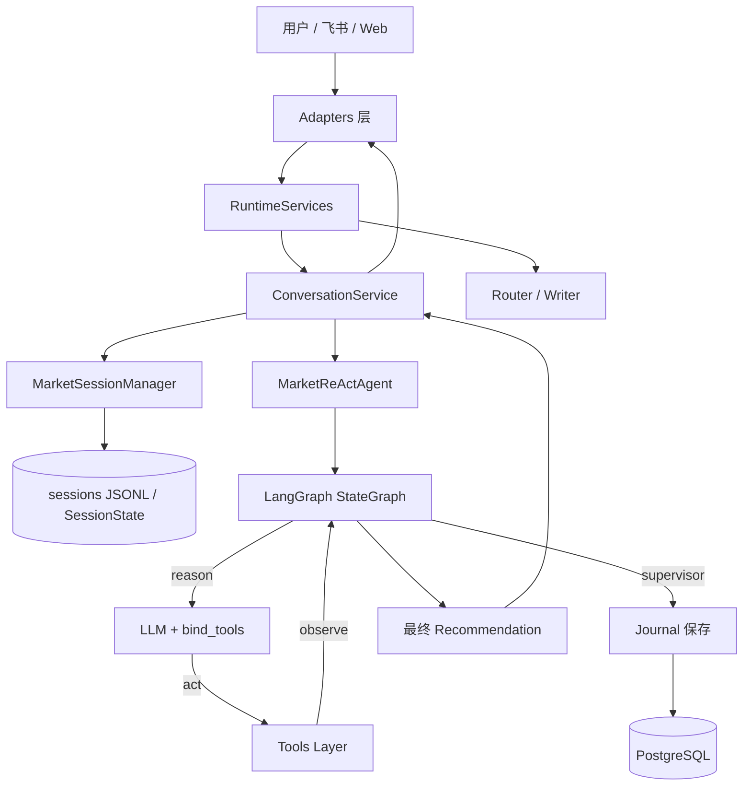

# MarketReActAgent 项目架构详解

**版本**: v4.5
**日期**: 2026-06-12

## 1. 项目概述

MarketReActAgent 是一个基于 **LangGraph ReAct 架构** 的金融市场智能 Agent，支持多市场（股票、加密货币、黄金）的技术分析、多轮对话、条件化交易建议、真实研报搜索、会话记忆和交易记录持久化。

核心目标：提供一个**干净、可扩展、可部署**的生产级 Agent 框架。

## 2. 整体架构



运行时对象由 `app_factory.py` 统一装配。真实入口不直接创建 `MarketSessionManager` 或 `ConversationService`，而是通过 `RuntimeServices` 注入使用。

## 3. 核心模块详解

### 3.1 Core 层（`core/`）

- `state.py`: `AgentState` + `AnalysisSnapshot`（TypedDict）
- `prompt.py`: ReAct System Prompt
- `graph.py`: `make_call_model(llm)` + `build_graph(llm)`（支持真正 Tool Calling）
- `agent.py`: `MarketReActAgent` 主入口（LLM 初始化 + Journal 保存集成）
- `supervisor.py`: 最终输出守卫 + recommendation 生成

### 3.2 Tool 系统（`tools/`）

- `registry.py`: 统一工具注册
- `technical_analysis.py`: `analyze_market`（核心分析工具）
- `research.py`: `search_research_reports`（真实 yanbaoke 调用）
- `sim_account.py`: 模拟交易工具
- `market_data.py`: 数据抽象
- `yanbaoke/`: 研报搜索客户端 + Node.js 脚本

### 3.3 Persistence 层（`persistence/`）

- `models.py`: `Journal` 模型
- `db.py`: 引擎 + Session 管理
- `journal_repository.py`: Journal CRUD
- `alembic/`: 数据库迁移

### 3.4 API & Adapters 层

- `api/routes.py`: `/api/agent/run`
- `adapters/feishu_adapter.py`: 飞书消息处理
- `adapters/web_adapter.py`: Web 调用薄封装

入口层只负责协议适配、身份解析和 `session_id` 映射。Web、飞书分析路径、飞书闲聊路径均通过 `ConversationService` 统一完成会话历史读写。

### 3.5 Services 层（`services/`）

- `conversation_service.py`: 唯一会话编排层

`ConversationService` 固定执行：

1. 保存用户消息
2. 读取最近对话历史
3. 调用 `MarketReActAgent.invoke(...)` 或自定义 `invoke_fn`
4. 提取回复文本
5. 保存 assistant 回复
6. 返回统一结果结构

`invoke_fn` 用于飞书 chat 等非分析路径，保证 chat/analyze 共用同一记忆编排链。

### 3.6 Memory 层（`memory/`）

- `session_manager.py`: `MarketSessionManager` + `SessionManager`
- `session_store.py`: SessionState 内存缓存与 JSON 持久化
- `json_persistence.py`: 对话历史 JSONL 持久化
- `snapshot.py`: AnalysisSnapshot 管理
- `feishu_memory.py`: deprecated 兼容文件，主路径不再使用

当前唯一真相源为 `MarketSessionManager`。`FeishuMemory` 已退出主路径，仅保留兼容。

### 3.7 Runtime 装配

- `app_factory.py`: 唯一运行时装配点
- `RuntimeServices`: 持有 `repo_root`、`agent`、`session_manager`、`conversation_service`、`router`、`writer`、`feishu_adapter`、`web_adapter`

所有真实入口均从 `RuntimeServices` 获取依赖，不在入口层自行创建运行时对象。

### 3.8 配置与部署

- `config/runtime_config.py`: LLM 配置读取（对齐 Stock_Analysis）
- `Dockerfile` + `docker-compose.yml`: 一键部署
- `cli/api_server.py`: HTTP 应用入口 + 数据库初始化

## 4. 数据流

### 4.1 Web / API 链路

1. 用户输入 → `/api/agent/run`
2. `api/routes.py` 从 `request.app.state.services` 获取 `ConversationService`
3. `ConversationService` 保存 user 消息并读取最近历史
4. `ConversationService` 调用 `MarketReActAgent.invoke(text, session_id, history)`
5. LangGraph 执行 `reason` → `act`（Tool Calling）→ `supervisor`
6. `supervisor` 生成 `recommendation`
7. 如果包含交易建议，自动保存到 `journals` 表
8. `ConversationService` 提取回复、生成统一 envelope，并保存 assistant 消息
9. API 返回 `{ "envelope": ... }`

### 4.2 飞书链路

1. 飞书长连接收到消息 → `FeishuAdapter`
2. `FeishuAdapter` 映射 `session_id = feishu_{open_id}`
3. `Router` 使用注入的 `MarketSessionManager` 读取历史辅助意图分类
4. `intent == analyze` 时走 `ConversationService + MarketReActAgent`
5. `intent == chat` 时走 `ConversationService + chat invoke_fn`
6. Writer / 飞书卡片格式化后发送回复

### 4.3 会话持久化链路

```text
ConversationService
  -> MarketSessionManager
  -> SessionManager
  -> JsonSessionPersistence
  -> sessions/{session_id}/_history.jsonl
```

`SessionState` 与 `AnalysisSnapshot` 用于追问上下文和分析快照，对话历史仍由 JSONL 持久化负责。

## 5. LLM 配置

支持通过 `analysis_defaults.yaml` + 环境变量灵活切换：

- OpenAI
- DeepSeek
- OpenRouter
- HCT

使用 `get_llm_runtime_settings()` 动态创建 LLM 实例。

## 6. 部署

- 支持 Docker 一键启动（Python + Node.js + PostgreSQL）
- 推荐使用 `docker compose up`

## 7. 测试

当前测试覆盖：

- Dummy LLM 流程
- Supervisor recommendation 生成
- Research 工具调用
- Journal Repository
- AU0 / AKShare 数据源验证
- Web 真实入口记忆验证脚本：`scripts/verify_web_memory.py`
- 真实 Tool Calling 连通性脚本（DeepSeek / HCT）

## 8. 前端演进

- 当前建议将 Web UI 视为与 CLI、飞书长连接并列的 transport，而不是第二套业务核心
- Web 入口必须通过 `ConversationService` 访问 Agent，不直接编排会话历史
- 详细方案见 `docs/02_FRONTEND_TRANSPORT_PLAN.md`

## 9. 行情数据源

- A 股 / 美股 / 港股：TickFlow
- 加密货币：Gate.io REST API
- 国内黄金：AKShare 新浪期货接口，默认 `AU0`（沪金连续）

旧 goldapi REST 路径已不再作为主方案。

## 10. 当前架构边界

- `ConversationService` 负责会话编排，但暂未实现 history truncation / summary compaction 自动策略
- LangGraph checkpointer 暂未接入；它作为运行态恢复增强项，不作为主记忆方案
- 飞书、Web 的 session 规则不同：Web 使用请求传入 `session_id`，飞书使用 `feishu_{open_id}`
- 密钥配置仍允许本地 YAML 手动调整；生产部署时建议改走环境变量

---

**架构优势**：

- 干净的分层（Core / Tools / Persistence / API）
- 运行时对象统一装配（RuntimeServices）
- Web / 飞书统一会话记忆链路
- 真正的 Tool Calling 支持
- 多 LLM 提供商灵活切换
- 完整的数据库持久化 + 迁移
- Docker 友好部署

此文档为项目核心架构说明，后续演进请在此基础上更新。
