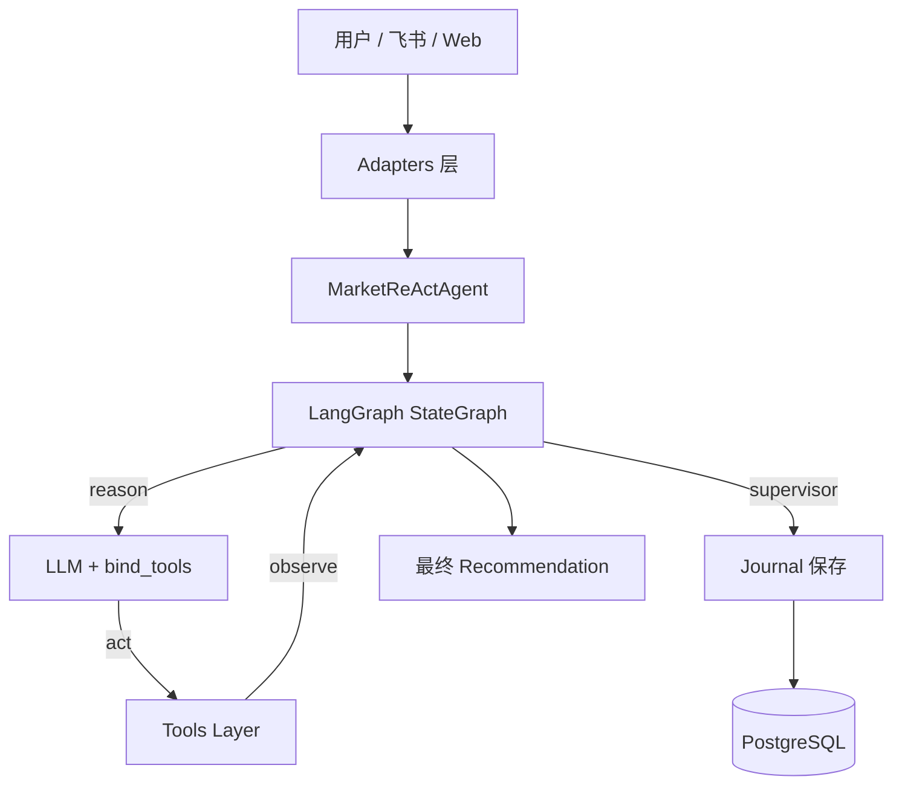

# MarketReActAgent 项目架构详解

**版本**: v4.2  
**日期**: 2026-06-05

## 1. 项目概述

MarketReActAgent 是一个基于 **LangGraph ReAct 架构** 的金融市场智能 Agent，支持多市场（股票、加密货币、黄金）的技术分析、多轮对话、条件化交易建议、真实研报搜索和交易记录持久化。

核心目标：提供一个**干净、可扩展、可部署**的生产级 Agent 框架。

## 2. 整体架构

## 3. 核心模块详解

### 3.1 Core 层（`core/`）

- `state.py`: `AgentState` + `AnalysisSnapshot`（TypedDict）
- `prompt.py`: ReAct System Prompt
- `graph.py`: `make_call_model(llm)` + `build_graph(llm)`（支持真正 Tool Calling）
- `agent.py`: `MarketReActAgent` 主入口（LLM 初始化 + Journal 保存集成）
- `supervisor.py`: 最终输出守卫 + recommendation 生成

### 3.2 Tool 系统（`tools/`）

- `registry.py`: 统一工具注册
- `technical_analysis.py`: `analyze_market`（核心分析工具）
- `research.py`: `search_research_reports`（真实 yanbaoke 调用）
- `sim_account.py`: 模拟交易工具
- `market_data.py`: 数据抽象
- `yanbaoke/`: 研报搜索客户端 + Node.js 脚本

### 3.3 Persistence 层（`persistence/`）

- `models.py`: `Journal` 模型
- `db.py`: 引擎 + Session 管理
- `journal_repository.py`: Journal CRUD
- `alembic/`: 数据库迁移

### 3.4 API & Adapters 层

- `api/routes.py`: `/api/agent/run`
- `adapters/feishu_adapter.py`: 飞书消息处理
- `adapters/web_adapter.py`: Web 调用封装

### 3.5 配置与部署

- `config/runtime_config.py`: LLM 配置读取（对齐 Stock_Analysis）
- `Dockerfile` + `docker-compose.yml`: 一键部署
- `cli/api_server.py`: HTTP 应用入口 + 数据库初始化

## 4. 数据流

1. 用户输入 → `MarketReActAgent.invoke()`
2. 构建初始 `AgentState`
3. LangGraph 执行 `reason` → `act`（Tool Calling）→ `supervisor`
4. `supervisor` 生成 `recommendation`
5. 如果包含交易建议，自动保存到 `journals` 表
6. 返回最终结果

## 5. LLM 配置

支持通过 `analysis_defaults.yaml` + 环境变量灵活切换：

- OpenAI
- DeepSeek
- OpenRouter
- HCT

使用 `get_llm_runtime_settings()` 动态创建 LLM 实例。

## 6. 部署

- 支持 Docker 一键启动（Python + Node.js + PostgreSQL）
- 推荐使用 `docker compose up`

## 7. 测试

当前测试覆盖：

- Dummy LLM 流程
- Supervisor recommendation 生成
- Research 工具调用
- Journal Repository
- 真实 Tool Calling 连通性（DeepSeek / HCT）

## 8. 前端演进

- 当前建议将 Web UI 视为与 CLI、飞书长连接并列的 transport，而不是第二套业务核心
- 详细方案见 `docs/02_FRONTEND_TRANSPORT_PLAN.md`

---

**架构优势**：

- 干净的分层（Core / Tools / Persistence / API）
- 真正的 Tool Calling 支持
- 多 LLM 提供商灵活切换
- 完整的数据库持久化 + 迁移
- Docker 友好部署

此文档为项目核心架构说明，后续演进请在此基础上更新。
