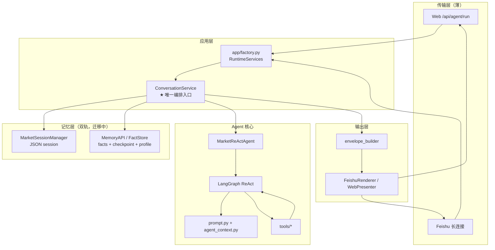
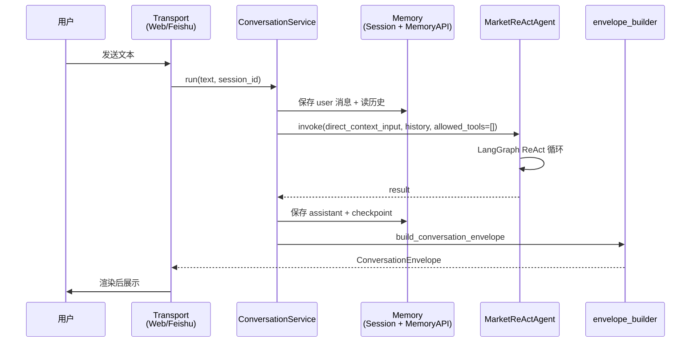
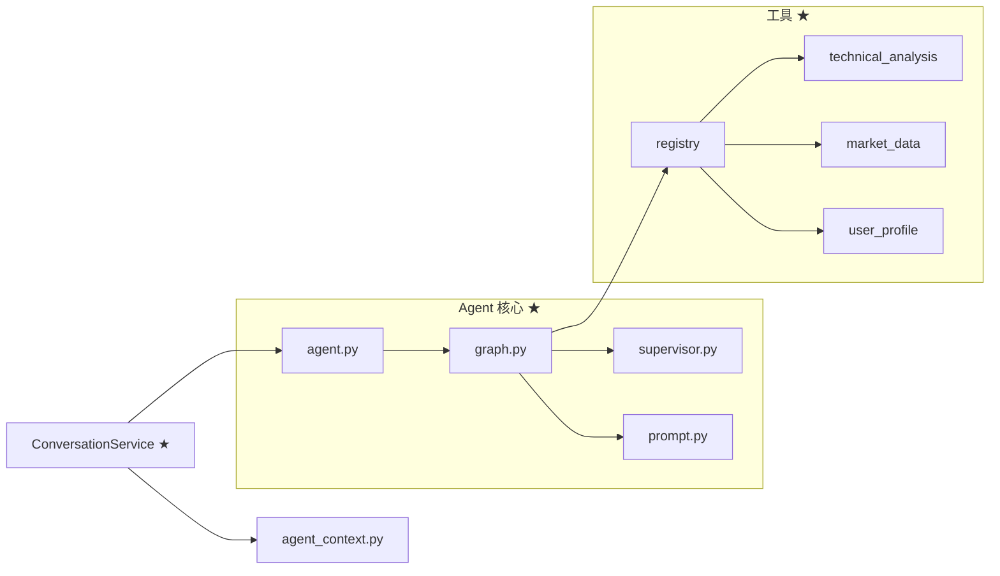
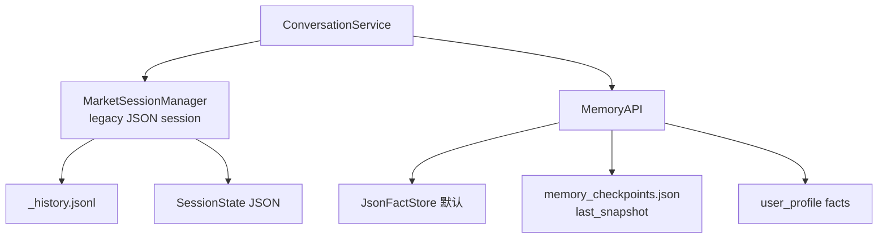

# MarketReActAgent 项目架构

**版本**: v5.1  
**日期**: 2026-06-18  
**状态**: Direct Context 主链路（Markdown-first 单链路）

---

## 1. 设计原则（避免新旧架构并存）

| 原则 | 含义 |
| --- | --- |
| **单编排入口** | 所有用户消息必须经过 `ConversationService.run()`，禁止在 adapter / route / CLI 里自行拼 `agent.invoke()` + 读写历史 |
| **单运行时装配点** | 依赖只从 `app/factory.py` → `RuntimeServices` 注入，禁止入口层 `new MarketSessionManager()` |
| **单 Prompt 决策** | ReAct 工具策略以 `core/prompt.py`（System）为准；任务上下文由 `core/agent_context.py` 统一注入 |
| **对话语义优先** | 完整上下文直达主 LLM（Direct Context）是唯一主链路，不再依赖 Planner / Orchestrator 作为中间决策层 |
| **Markdown-first 输出** | 对外主字段是 `ConversationEnvelope.reply_text`；`blocks` 恒空，不再维护 rich-card / Writer 层 |
| **配置即契约** | 只有 `config/runtime_config.py` 实际读取的 YAML 键才算有效配置；注释里写了但代码不读的键一律视为**无效** |
| **删旧不留 shim** | 废弃模块直接删除 + CI guard，禁止 `services/xxx.py` 仅 re-export 的兼容层 |

**CI 防回流**：`scripts/guard_no_legacy_memory_path.py`（PR 必跑）禁止顶层 `adapters/`、`core/router.py`、`memory/feishu_memory.py`、`core/planner.py`、`core/orchestrator.py` 等路径复活。

---

## 2. 端到端请求流程

### 2.1 总览（Web / 飞书共用）

### 2.2 单轮消息时序

### 2.3 session_id 规则

| 渠道 | session_id | 用户画像 storage_key |
| --- | --- | --- |
| Web | 客户端传入（如 `web_xxx`） | 同 session_id |
| 飞书 | `feishu_{open_id}` | `open_id`（去掉前缀） |

---

## 3. 代码分层与目录职责

### 3.1 图例

| 标记 | 含义 |
| --- | --- |
| ★ **核心** | 改行为必看；生产主路径 |
| ○ **辅助** | 支撑核心，但非业务决策 |
| △ **传输** | 协议/渠道适配，不含业务逻辑 |
| ✕ **禁止新增** | 已删除或 CI 拦截的遗留路径 |

### 3.2 目录总表

| 目录 / 文件 | 层级 | 职责 |
| --- | --- | --- |
| **`services/conversation_service.py`** | ★ 核心 | 唯一会话编排：写历史 → 构造 Direct Context → `agent.invoke` → 提取回复 → 写 MemoryAPI |
| **`core/agent_context.py`** | ★ 核心 | Direct Context 构造（runtime/user_profile/snapshot/sources/current_message） |
| **`core/agent.py`** | ★ 核心 | `MarketReActAgent.invoke()` LangGraph 入口 |
| **`core/graph.py`** | ★ 核心 | ReAct 状态图：reason → act → observe → supervisor |
| **`core/prompt.py`** | ★ 核心 | ReAct **System Prompt**（工具策略、周期规则、输出格式） |
| **`core/state.py`** | ★ 核心 | `AgentState` / `AnalysisSnapshot` TypedDict |
| **`core/supervisor.py`** | ★ 核心 | 最终 recommendation 与 journal 触发 |
| **`tools/technical_analysis.py`** | ★ 核心 | 统一行情分析工具 `analyze_market` 及关键位/结构等分析工具 |
| **`tools/registry.py`** | ★ 核心 | 工具注册与分组 |
| **`tools/market_data.py`** | ★ 核心 | 多市场行情拉取 |
| **`tools/user_profile.py`** | ★ 核心 | 用户画像读写工具 |
| **`core/memory_api.py`** | ★ 核心 | 长期记忆统一 API |
| **`core/json_fact_store.py`** | ○ 辅助 | MemoryAPI 默认 JSON 后端 |
| **`core/postgres_fact_store.py`** | ○ 辅助 | MemoryAPI 可选 PG 后端 |
| **`memory/session_manager.py`** | ○ 辅助 | 短期 JSON 会话（history + SessionState） |
| **`memory/json_persistence.py`** | ○ 辅助 | `_history.jsonl` 读写 |
| **`memory/snapshot.py`** | ○ 辅助 | 进程内 AnalysisSnapshot（`get_key_levels` 用；**非**主记忆源） |
| **`services/envelope_builder.py`** | ○ 辅助 | 组装 `ConversationEnvelope`（Markdown-first） |
| **`schemas/conversation.py`** | ○ 辅助 | 对外响应契约（`reply_text` + 空 `blocks`） |
| **`persistence/*`** | ○ 辅助 | Journal / Account PostgreSQL |
| **`config/runtime_config.py`** | ○ 辅助 | **唯一** YAML 配置读取入口 |
| **`config/analysis_defaults.yaml`** | ○ 辅助 | 本地运行参数（LLM、PG、memory、feishu 凭证） |
| **`utils/*`** | ○ 辅助 | 日志、运行目录 |
| **`app/factory.py`** | ★ 核心 | **唯一** Dependency Injection / `RuntimeServices` |
| **`app/api/routes.py`** | △ 传输 | HTTP `/api/agent/run` |
| **`app/adapters/feishu_adapter.py`** | △ 传输 | 飞书收消息、调 ConversationService、发卡片 |
| **`app/adapters/feishu_longconn.py`** | △ 传输 | 飞书 WS 长连接循环 |
| **`app/adapters/web_adapter.py`** | △ 传输 | Web 薄封装 |
| **`interfaces/renderers/feishu_renderer.py`** | △ 传输 | Markdown → 飞书 interactive 卡片 |
| **`interfaces/renderers/web_renderer.py`** | △ 传输 | Web Markdown 渲染 |
| **`interfaces/presenters/web_presenter.py`** | △ 传输 | API JSON 包装 |
| **`cli/feishu_bot.py`** | △ 传输 | 飞书进程入口 |
| **`cli/api_server.py`** | △ 传输 | FastAPI 进程入口 |
| **`web/*`** | △ 传输 | 静态聊天页（无业务逻辑） |
| **`tests/*`** | 测试 | 见 §5 |
| **`scripts/*`** | 脚本 | 见 §6 |
| **`docs/*`** | 文档 | 架构说明与演进记录 |
| **`output/`、`sessions/`** | 运行产物 | 本地/用户目录数据，非源码 |
| ✕ `adapters/`（顶层） | 已删 | 改用 `app/adapters/` |
| ✕ `core/router.py` | 已删 | 旧 intent 路由 |
| ✕ `core/writer.py` | 已删 | 旧 narrative writer |
| ✕ `memory/feishu_memory.py` | 已删 | 旧飞书专用记忆 |
| ✕ `FeishuPresenter` | 已删 | 飞书直接用 Renderer + Adapter |
| ✕ `config/market_config.json` | 已删 | 无代码引用 |
| ✕ YAML `agent.*` / `feishu.llm_router_*` | 已删 | runtime 不读取 |

### 3.3 核心模块关系（精简）

---

## 4. 有效配置清单

**只有下表中的键会被 `runtime_config.py` 或入口层读取**。往 YAML 加新字段时，必须同时加读取代码，否则视为无效配置。

| YAML 块 | 读取方 | 用途 |
| --- | --- | --- |
| `llm.*` | `get_llm_runtime_settings()` | 主模型 Provider |
| `feishu.app_id/app_secret` | `feishu_adapter` | 飞书凭证 |
| `memory.backend` | `create_default_memory_api()` | json / postgres |
| `session.storage_dir` | `load_session_config()` | 会话 JSON 目录 |
| `feature_flags.memory_api_only_mode` | `ConversationService` | 是否停写 legacy session |
| `database.postgres.*` | persistence | Journal / Account |
| `accounts.*` / `account_system.*` | 纸交易 | 仓位公式 |
| `ma_system.*` / `journal_*` / `pivot_*` | 分析工具 | 技术指标参数 |

**已移除、勿再添加的配置**：

- `feishu.memory.*`、`feishu.llm_router_*`、`feishu.narrative_*`
- `agent.writer_*`、`agent.context.*`、`agent.pre_judge.*`
- `session.compact_*`、`session.auto_migrate_feishu`
- `config/market_config.json`

---

## 5. 测试目录（`tests/`）

自动化测试，**不是**生产代码。按主题分类：

| 文件 | 覆盖 |
| --- | --- |
| `test_agent.py` / `test_supervisor.py` | LangGraph 基础流程 |
| `test_direct_agent_context_flow.py` | Direct Context 主链路（上下文注入/降级/sources） |
| `test_conversation_envelope.py` / `test_feishu_renderer.py` | 输出契约与渲染 |
| `test_phase_c_memory_flow.py` / `test_memory_api*.py` / `test_json_fact_store.py` | MemoryAPI |
| `test_user_profile_memory.py` / `test_user_profile_tools_injection.py` | 用户画像 |
| `test_session_json_persistence.py` | JSON 会话持久化 |
| `test_journal_repository.py` / `test_agent_journal.py` | PG Journal |
| `test_research.py` / `test_recommendation_parsing.py` | 研报与解析 |
| `test_au0_akshare.py` | 黄金数据源 |
| `test_real_tool_calling.py` | 真实 LLM 连通（可选 / 慢） |
| `test_runtime_memory_api_default.py` | factory 装配约束 |
| `test_analysis_output_sanitize.py` | 输出相关回归 |
| `test_agent_thread_id.py` | session_id 传递 |

运行：`python3 -m pytest tests/ -q`

---

## 6. 脚本目录（`scripts/`）

人工/CI 辅助，**不参与**生产请求路径：

| 脚本 | 类型 | 用途 |
| --- | --- | --- |
| `guard_no_legacy_memory_path.py` | **CI 门禁** | 禁止遗留路径与 import 回流 |
| `feishu_dev.sh` | 开发启动 | 本地飞书 bot |
| `web_dev.sh` | 开发启动 | 本地 Web + API |
| `smoke_response_style.py` | 冒烟 | LLM 输出风格检查（mock / live） |
| `smoke_feishu_renderer.py` | 冒烟 | 飞书卡片渲染 |
| `verify_web_memory.py` | 集成验证 | Web 记忆链路（需 API 已启动） |

`tools/yanbaoke/scripts/*.mjs` 属于研报工具的 Node 子进程，随 `search_research_reports` 调用，归类为**工具依赖脚本**。

---

## 7. 记忆架构（摘要）

完整说明见 [`docs/06_AGENT_MEMORY_ARCHITECTURE.md`](06_AGENT_MEMORY_ARCHITECTURE.md)。

- **主记忆写入**：`ConversationService` 双写 `recent_message`（MemoryAPI）+ JSON session（除非 `memory_api_only_mode=true`）
- **分析快照**：优先 MemoryAPI checkpoint；进程内 `snapshot_manager` 仅服务 `get_key_levels` 工具，后续应收敛到 MemoryAPI

---

## 8. 新增功能时的检查清单

在 PR 合并前自检：

1. **入口**：是否只调用了 `ConversationService.run()`？
2. **装配**：新依赖是否从 `app/factory.py` 注入？
3. **配置**：新 YAML 键是否在 `runtime_config.py`（或明确入口）有读取逻辑？
4. **Prompt**：周期/工具策略是否写在 `prompt.py`，并与 `agent_context.py` 的 Direct Context 注入一致？
5. **输出**：是否以 `reply_text` 为主，而非新增 Writer / Presenter 层？
6. **兼容层**：是否避免了「旧文件 re-export + 新文件实现」双轨？
7. **CI**：`pytest` + `guard_no_legacy_memory_path.py` 是否通过？
8. **文档**：是否更新本文档目录表与流程图？

---

## 9. 相关文档索引

| 文档 | 内容 |
| --- | --- |
| [`00_PROJECT_ARCHITECTURE.md`](00_PROJECT_ARCHITECTURE.md) | **本文** — 总架构与目录分层 |
| [`03_ARCH_REFACTOR_TODO.md`](03_ARCH_REFACTOR_TODO.md) | 演进待办 + 防回流约束 |
| [`06_AGENT_MEMORY_ARCHITECTURE.md`](06_AGENT_MEMORY_ARCHITECTURE.md) | 记忆双轨与 MemoryAPI 细节 |
| [`04_LLM_TOOL_AUTONOMY_PLAN.md`](04_LLM_TOOL_AUTONOMY_PLAN.md) | LLM 工具自主性演进 |
| [`02_FRONTEND_TRANSPORT_PLAN.md`](02_FRONTEND_TRANSPORT_PLAN.md) | Web 作为 transport 的约定 |
| [`01_AGENT_ARCH_UPDATE_LOG.md`](01_AGENT_ARCH_UPDATE_LOG.md) | 历史变更日志（只增不改旧条目） |

---

**架构优势（当前基线）**：

- 单编排链路，Web / 飞书零分叉
- Direct Context 直达主 LLM，链路更短、状态更可追踪
- MemoryAPI 默认启用，JSON 开箱即用
- Markdown-first，无 Writer/Router 第二套决策
- CI guard 防止目录回退

后续演进请**先改本文档与流程图**，再动代码。
