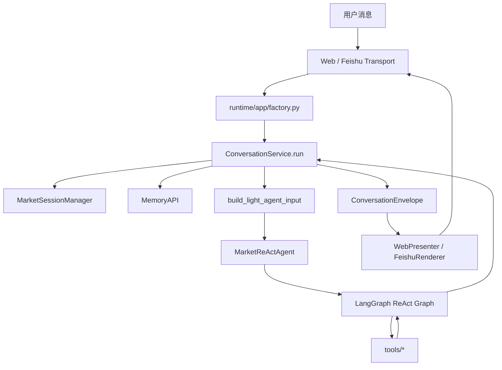
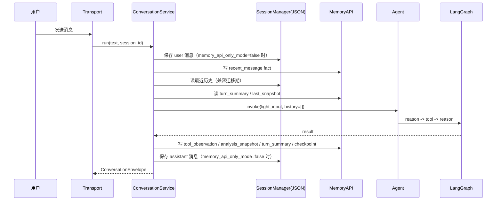

# MarketAssAgent 项目架构

**版本**: v6.0
**日期**: 2026-07-13
**状态**: 当前代码主链路基线

---

## 1. 当前结论

项目当前已经收敛到一条比较稳定的主链路：

1. `runtime/app/factory.py` 是唯一运行时装配点。
2. `ConversationService.run()` 是唯一会话编排入口。
3. 首屏输入采用 `light-only` 模式，只注入轻量历史摘要，不再预塞完整上下文。
4. LLM 通过 LangGraph ReAct loop 按需调用上下文工具、行情工具、画像工具、模拟交易工具。
5. 会话与分析承接依赖 `turn_summary + analysis_snapshot + last_snapshot + recent_message`，其中默认持久化后端仍是本地 JSON/JSONL。

这意味着当前“分析能力”和“会话承接能力”的稳定点，不在于前置分类器或多层 planner，而在于：

- 轻入口摘要足够让模型理解当前轮问题。
- 需要更多证据时，模型可以自己补查上下文与行情。
- 每轮结束都会沉淀结构化摘要和快照，为后续追问服务。

---

## 2. 主链路总览



### 2.1 单轮时序



### 2.2 当前与旧方案的关键区别

| 维度 | 当前实现 | 已不再作为主路径 |
| --- | --- | --- |
| 首屏上下文 | `build_light_agent_input()` 轻摘要 | 预注入重型 Direct Context |
| 历史承接 | `turn_summary` 优先，缺失时回退原始 history | 每轮把较完整上下文直接塞进 prompt |
| 补证方式 | LLM 按需调用 context / market / profile / journal 工具 | 代码层预判本轮需要什么材料 |
| Graph 状态 | `checkpointer=None`, `store=None`，不做持久化图状态 | 持久化 graph state 目前未启用 |

---

## 3. 真实代码分层

### 3.1 入口与装配

| 路径 | 职责 |
| --- | --- |
| `runtime/app/factory.py` | 创建 `RuntimeServices`，装配 Agent / Session / MemoryAPI / ConversationService / FeishuAdapter |
| `runtime/app/api/routes.py` | HTTP `/api/agent/run`，只做协议入参和依赖转发 |
| `runtime/cli/api_server.py` | Web/API 进程入口 |
| `runtime/cli/feishu_bot.py` | 飞书长连接进程入口 |

### 3.2 应用层

| 路径 | 职责 |
| --- | --- |
| `src/application/services/conversation_service.py` | 唯一会话编排入口；负责读写历史、构造 light input、调用 Agent、沉淀摘要/快照 |
| `src/application/services/envelope_builder.py` | 统一输出 envelope |
| `src/application/presenters/web_presenter.py` | Web 输出包装 |

### 3.3 Agent 核心

| 路径 | 职责 |
| --- | --- |
| `src/core/agent.py` | Agent 主入口，负责创建 LLM、组装 graph、执行 invoke |
| `src/core/graph.py` | LangGraph ReAct loop，负责 tool calling、重复调用 guardrail、调试轨迹 |
| `src/core/prompt.py` | 系统提示词；约束行情回答结构、同标的历史快照查询规则 |
| `src/core/agent_context.py` | `build_light_agent_input()`，只构造轻量摘要首屏输入 |
| `src/core/memory_api.py` | `MemoryAPI` 与默认后端装配 |

### 3.4 领域与工具

| 路径 | 职责 |
| --- | --- |
| `src/domain/market/*` | 行情分析、结构判断、关键位、斐波那契、快照生成 |
| `src/domain/profile/user_profile.py` | 用户画像读写 |
| `src/tools/context_memory.py` | 上下文补证工具：`get_last_snapshot` / `get_previous_analysis_snapshot` / `get_recent_tool_observations` / `search_conversation_summaries` |
| `src/tools/market_data.py` | 原始行情数据获取 |
| `src/tools/sim_account.py` | 模拟开仓与查询台账 |
| `src/tools/research.py` | 研报搜索 |
| `src/tools/registry.py` | 工具统一注册 |

### 3.5 基础设施

| 路径 | 职责 |
| --- | --- |
| `src/infrastructure/memory/*` | JSON session、SessionState、本地历史持久化 |
| `src/infrastructure/adapters/*` | 飞书适配与渲染 |
| `src/infrastructure/persistence/*` | PostgreSQL 连接、`journals` 表、仓储访问 |

---

## 4. 稳定的会话与分析承接机制

当前稳定点主要来自以下四类持久化对象：

### 4.1 `recent_message`

- 来源：`ConversationService._write_message_fact()`
- 用途：迁移期 MemoryAPI 历史读取；与 legacy JSON history 并行

### 4.2 `turn_summary`

- 来源：`ConversationService._write_turn_summary_fact()`
- 用途：light 首屏优先读取的滚动历史摘要
- 价值：把多轮会话压成结构化摘要，而不是把原始对话整段塞回 prompt

### 4.3 `last_snapshot` checkpoint

- 来源：`ConversationService._save_snapshot_checkpoint()`
- 用途：承接最近一次分析的主快照，用于“刚才那个点位还有效吗”一类追问

### 4.4 `analysis_snapshot`

- 来源：`ConversationService._write_analysis_snapshot_fact()`
- 用途：同会话、同标的、同周期的横向对比
- 价值：支持“相比上次同标的分析有什么变化”这类问题，而且已经通过 `get_previous_analysis_snapshot` 工具显式接入主链路

### 4.5 当前摘要构造策略

`ConversationService` 的 light summary 构造顺序是：

1. 优先读最近 `turn_summary`
2. 用 `last_snapshot` 构造 `snapshot_hint`
3. 生成 `current_carryover_hint`
4. 若 `turn_summary` 缺失，再回退最近原始 history 做临时压缩

这套顺序比直接回放原始历史更稳定，也更适合短问句和追问混用的场景。

---

## 5. 数据与状态现状

### 5.1 当前默认持久化

| 数据 | 当前默认后端 | 说明 |
| --- | --- | --- |
| 会话历史 | JSON/JSONL | `MarketSessionManager` |
| SessionState | JSON | 仍由 session manager 管理 |
| facts / checkpoints / user_profile | JSON/JSONL | `MemoryAPI -> JsonFactStore` |
| Graph thread state | 不持久化 | `checkpointer=None`, `store=None` |
| 模拟交易台账 | PostgreSQL | best-effort，可用但不是主链路前提 |

### 5.2 数据库在当前架构中的真实位置

数据库现在不是“会话系统”的底座，而是一个独立的、可选的业务持久化能力：

- `runtime/app/factory.py` 启动时调用 `init_db()`，失败只记 warning，不阻塞主链路。
- `src/tools/sim_account.py` 可以真实写入和查询 `journals` 表。
- `src/core/postgres_fact_store.py` 已存在，但默认不启用。
- 2026-07-13 已下线 `src/core/agent.py` 基于自然语言正则解析 `recommendation.text` 后自动写 journal 的旁路；当前只保留 `simulate_open_position` 这类显式写入口。

结论：数据库能力已经有“入口”，但还没有收敛成稳定的数据模型和明确的业务边界。
下一阶段的目标不是“把聊天搬进 PG”，而是“用户确认跟踪时显式创建 `journal_idea + paper_order`，并在回答前由代码自动兑单”。

---

## 6. 当前数据库相关代码边界

### 6.1 已有能力

| 能力 | 当前实现 |
| --- | --- |
| Journal 表 | `src/infrastructure/persistence/models.py` 的 `journals` |
| 仓储访问 | `src/infrastructure/persistence/journal_repository.py` |
| 模拟开仓工具 | `simulate_open_position` |
| 查询当前持仓 | `get_journal_status` |
| 可选 FactStore PG 后端 | `src/core/postgres_fact_store.py` |

### 6.2 当前缺口

| 缺口 | 说明 |
| --- | --- |
| 迁移链不完整 | 仓库只看到 `journal_001`，本机库曾出现 `journal_005` |
| journal 语义过薄 | 只有一张 `journals` 表，不足以表达事件流、复盘、加减仓、平仓原因 |
| 正式交易写入口仍是过渡态 | 文案驱动自动写库已下线；当前只剩 `simulate_open_position` 这类显式入口，但尚未升级到 `journal_ideas + paper_orders + journal_events` |
| 数据与分析脱节 | 交易记录没有稳定关联 `analysis_snapshot` / `turn_summary` / tool provenance |

补充背景：

- `~/code/Stock_Analysis` 已存在一套更完整、且已被运行时代码消费的交易域数据库设计。
- 当前项目的数据库下一阶段，优先参考那套“idea / event / order / fill / ledger / position”分层思路，但按当前需求做最小裁剪，而不是直接照搬全部实现。

---

## 7. 下一阶段的架构方向

在当前“分析能力、会话能力”已经可用的前提下，数据库下一步不建议优先替换整个记忆系统，而建议先承接更适合结构化存储的交易域能力：

1. 模拟开单
2. 持仓状态追踪
3. 平仓/止损/止盈事件
4. 交易复盘
5. 分析结论与交易动作的可追踪关联

推荐优先级：

```text
先把 DB 用在“模拟交易域”
  -> 用户确认跟踪时创建 journal_idea + paper_order
  -> 每次相关行情/复盘请求前自动兑单
  -> 再把复盘能力接上
  -> 最后再评估是否把 MemoryAPI 默认后端切到 PostgreSQL
```

原因：

- 会话与分析现在默认 JSON 就能稳定跑，不是最急的瓶颈。
- 模拟开单和复盘天然需要结构化查询、事件追踪和审计。
- 一上来就统一所有记忆到 PostgreSQL，成本更高，且会把当前稳定链路重新带入迁移风险。

---

## 8. 扩展规则

新增功能前先检查：

1. 是否仍通过 `ConversationService.run()` 进入主链路。
2. 是否把依赖放在 `runtime/app/factory.py` 装配，而不是在 adapter/tool 里自行 new。
3. 是否优先复用 `turn_summary / analysis_snapshot / user_profile / tool_observation`，而不是增加新的并行上下文通道。
4. 如果涉及数据库写入，是否明确是“显式结构化写入”，而不是从自然语言回复里反推。
   交易域里至少要能回答“确认跟踪时写了哪条 `paper_order`，执行关键字段是不是显式列”。
5. 是否同步更新本文档、`docs/07_DATABASE_UNIFICATION_PLAN.md` 与 `docs/18_TRADING_DOMAIN_BUSINESS_DESIGN.md`。

---

## 9. 相关文档

| 文档 | 内容 |
| --- | --- |
| [`00_PROJECT_ARCHITECTURE.md`](00_PROJECT_ARCHITECTURE.md) | 当前总架构与真实主链路 |
| [`16_RESPONSE_CONTRACT_ARCHITECTURE_PLAN.md`](16_RESPONSE_CONTRACT_ARCHITECTURE_PLAN.md) | light-only 主链路与工具按需补证的设计细节 |
| [`17_ANALYSIS_SNAPSHOT_MEMORY_PLAN.md`](17_ANALYSIS_SNAPSHOT_MEMORY_PLAN.md) | 分析快照记忆与“相比上次”能力 |
| [`07_DATABASE_UNIFICATION_PLAN.md`](07_DATABASE_UNIFICATION_PLAN.md) | 数据库下一阶段路线：模拟开单、复盘、统一治理 |
| [`18_TRADING_DOMAIN_BUSINESS_DESIGN.md`](18_TRADING_DOMAIN_BUSINESS_DESIGN.md) | 交易域业务边界：自动兑单、状态流转、最小表模型 |
| [`INDEX.md`](INDEX.md) | 文档索引 |

后续如果主链路发生变化，先更新本文档，再改代码。
