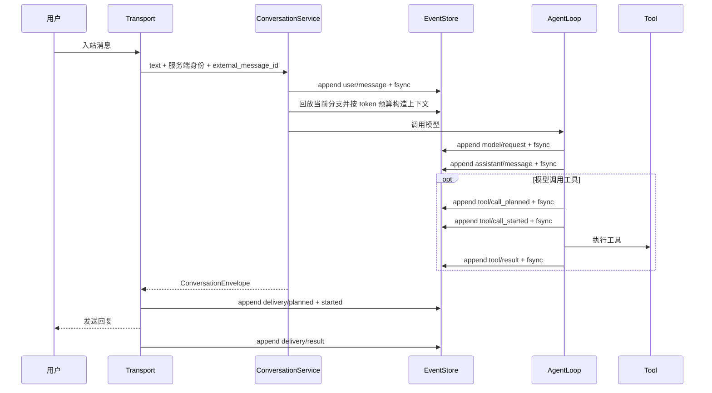

# MarketAssAgent 项目架构

**版本**：v8.0
**日期**：2026-09-20
**状态**：当前代码主链路

## 1. 架构结论

项目只保留一条对话编排链路：

```text
Web / Feishu
  -> ConversationService
  -> LocalSessionEventStore（append-only JSONL）
  -> SessionCompactor / SessionContextBuilder
  -> MarketReActAgent / NativeAgentLoop
  -> ToolExecutor
  -> ConversationEnvelope
  -> WebPresenter / FeishuRenderer
```

会话上下文以原始事件为唯一真相源。`turn_summary`、`recent_message`、`last_snapshot` 会话 checkpoint、旧 JSON session manager 和 PostgreSQL FactStore 均已退出运行时代码。

PostgreSQL 仍是交易业务能力，不是对话基础设施。数据库不可用时，模拟交易、持仓和分析快照工具可以失败；普通对话、上下文回放、压缩与历史检索仍应工作。

## 2. 入口与装配

`runtime/app/factory.py` 是唯一运行时装配点：

- 创建 `MarketReActAgent`。
- 创建本地 `DefaultMemoryAPI`，只保存显式用户画像。
- 创建 `LocalSessionEventStore`，保存对话事件。
- 将 Agent 和 EventStore 注入 `ConversationService`。
- 将 ConversationService 注入 Web 与飞书入口。

入口不得自行维护会话历史，也不得把数据库查询结果当作会话记忆。

## 3. 会话可见域

| 入口 | 隔离键 | 行为 |
| --- | --- | --- |
| 飞书私聊 | `tenant_id + private + open_id` | 只读取该用户私聊历史 |
| 飞书群聊 | `tenant_id + group + chat_id` | 群成员共享群内历史，不读取任何人的私聊 |
| Web | `tenant_id + web + owner/session` | 只读取当前 Web 可见域 |

`actor_id` 只记录发言者，不参与扩大检索权限。同一用户从私聊进入群聊是全新对话，不同群之间也完全隔离。

## 4. 单轮时序



重复 webhook 使用 `(transport, tenant_or_app_id, external_message_id)` 去重。飞书入口不再使用进程内去重表提前丢弃消息，最终判定以持久事件为准。

## 5. 上下文与历史取证

- 默认上下文是近期完整原文 turn，不按固定条数截断工具调用与结果。
- 超出 token 预算时，在完整 turn 边界追加不可变 `context/compaction`。
- 历史 `model/request` 保存实际请求字节及 checkpoint 引用，可逐字复现输入。
- `search_session_history` 在当前可见域内跨 session 检索原始事件，并排除当前提问。
- 关于“之前、一直、多次、从未”的对话历史主张必须携带内部事件引用；发送前移除引用。
- `HistoricalClaimGuard` 校验引用，失败时只补查一次，仍不足则明确降级为证据不足。

行情历史事实与对话历史是两类证据。主张校验器只拦截“用户或助手之前说过什么”，不会把“最近一周 ETH 上涨”误判为对话回忆。

## 6. 数据边界

| 数据 | 权威存储 | 说明 |
| --- | --- | --- |
| 对话、模型请求、工具与投递事件 | 本地 JSONL EventStore | 唯一会话真相源 |
| 大消息和大工具结果 | 本地 content-addressed blob | 事件保存 hash 与有界投影 |
| 显式用户画像 | 本地 `profile_facts.jsonl` | 使用当前可见域 scope key |
| 分析快照 | PostgreSQL | 行情业务事实 |
| 模拟订单、持仓、交易事件 | PostgreSQL | 交易业务状态机 |

严禁把会话事件双写到 PostgreSQL，也严禁从模型参数接受用户、群或 scope 身份。

## 7. 核心模块

| 路径 | 职责 |
| --- | --- |
| `src/application/services/conversation_service.py` | 入站幂等、turn 编排、投递状态 |
| `src/infrastructure/memory/event_store.py` | JSONL 追加、锁、校验、分支、blob、删除 |
| `src/infrastructure/memory/session_journal.py` | 类型化事件写入与孤儿工具恢复 |
| `src/infrastructure/memory/context_builder.py` | 从活动分支构造模型上下文 |
| `src/infrastructure/memory/context_compactor.py` | token 预算与不可变检查点 |
| `src/tools/session_history.py` | 当前可见域内跨会话原文检索 |
| `src/tools/kline_chart.py` | 本地 K 线图 PNG 生成；当前不注册为 LLM 工具 |
| `src/core/historical_claim_guard.py` | 历史主张引用校验与降级 |
| `src/core/agent_loop.py` | 模型和工具循环、write-before-effect 协议 |
| `src/infrastructure/adapters/feishu_adapter.py` | 飞书协议转换与投递确认 |
| `src/infrastructure/persistence/*` | PostgreSQL 业务仓储，不承担对话记忆 |

## 8. 失败与恢复边界

- 尾部半行或尾部坏记录：持锁截断到最后有效偏移并记录恢复审计。
- 中部损坏：隔离整个 session 并 fail closed。
- 工具 `planned` 后未 `started`：记为 `interrupted`，确认未执行。
- 工具 `started` 后无结果：记为 `unknown`，禁止自动重复副作用。
- 投递 `started` 后无结果：记为 `unknown`，默认不自动重发。
- scope 删除：写 intent、取得排他 gate、原子隔离目录、写 tombstone，再清理 blob。
- 上下文超限：记录 `turn/aborted` 和本地回复，仍走完整投递事件链。

`CONTEXT_CRASH_POINT` 提供设计文档规定的 14 个崩溃注入位置；未设置时没有运行时影响。

## 9. 当前实施边界

核心 JSONL 会话链路已启用，旧链路已删除。生产发布前仍需完成：完整崩溃注入矩阵、指标接入、定期 blob 留存任务、备份与恢复演练，以及 Web 身份认证后的 owner scope 接入。

K 线图生成能力已作为本地工具预留：`src/tools/kline_chart.py` 使用 `fetch_market_data` 的 K 线数据和 `ma_system` 均线配置生成 PNG 文件。该能力当前不进入 `ToolRegistry`，LLM 不会自动调用，也不会自动通过飞书发送图片；后续接入时需要同时设计模型触发规则和飞书图片投递链路。

详细协议、阶段和验收矩阵见 [`22_Pi式上下文管理架构.md`](22_Pi式上下文管理架构.md)。分析快照与交易业务分别见 [`17_分析快照记忆方案.md`](17_分析快照记忆方案.md) 和 [`18_交易域业务设计.md`](18_交易域业务设计.md)。
