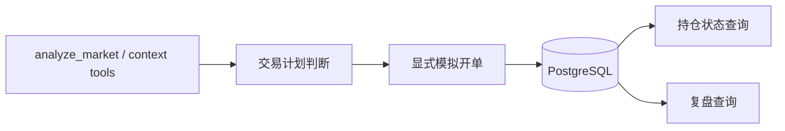

# 数据库统一治理与交易域落地计划

**更新时间**: 2026-07-13
**适用分支**: `main`
**定位**: 下一阶段架构路线文档

> **当前结论**：项目的分析能力和会话承接链路已经稳定，数据库下一步不应优先替换整套会话记忆，而应优先承担“分析成果沉淀 / 跟踪关键交易里程 / 为真实交易提供复盘参考”这类天然结构化的交易域能力。

交易域的业务边界、LLM 职责边界、自动兑单原则，见 [`18_TRADING_DOMAIN_BUSINESS_DESIGN.md`](18_TRADING_DOMAIN_BUSINESS_DESIGN.md)。

---

## 1. 当前数据库现状

### 1.1 已有代码能力

| 能力 | 代码位置 | 现状 |
| --- | --- | --- |
| PostgreSQL 连接与建表 | `src/infrastructure/persistence/db.py` | 启动时 best-effort 初始化，失败不阻塞主链路 |
| Journal 表 | `src/infrastructure/persistence/models.py` | 只有 `journals` 一张表 |
| Journal 仓储 | `src/infrastructure/persistence/journal_repository.py` | 支持 create/get/list/update_status |
| 模拟开仓工具 | `src/tools/sim_account.py:simulate_open_position` | 可真实写 journal |
| 持仓查询工具 | `src/tools/sim_account.py:get_journal_status` | 可读 session 下台账 |
| 可选 PG MemoryAPI 后端 | `src/core/postgres_fact_store.py` | 已实现，但默认不启用 |

### 1.2 当前真实限制

1. 默认主链路仍是 JSON/JSONL，会话和记忆不依赖数据库。
2. 当前仓库的 Alembic 迁移链不完整，仓库仅看到 `journal_001_create_journals.py`。
3. `journals` 结构过于扁平，只适合“记一条开仓建议”，不适合完整模拟交易生命周期。
4. 历史上曾存在 `src/core/agent.py` 从自然语言 `recommendation.text` 用正则提取方向/价格后自动写 journal 的逻辑；该旁路已于 2026-07-13 下线，后续不得恢复。

补充核查结果：

- `~/code/Stock_Analysis` 中存在完整迁移链 `journal_001` ～ `journal_005`。
- 这说明我们文档里之前提到的 `journal_002` ～ `journal_005` 不是“本机脏状态凭空出现”，而是来源于旧项目已落地的数据库设计。
- 当前项目若继续推进数据库能力，最合理的做法不是闭门重造 schema，而是先吸收那套已被运行时代码消费过的设计，再按当前 `MarketAssAgent` 的最小需求裁剪。

---

## 2. 为什么下一步该做数据库

当前项目最成熟的是两件事：

1. 分析结果已经能稳定产出结构化快照。
2. 多轮会话已经能稳定承接上下文。

这两件事已经给数据库落地创造了条件，因为数据库最适合承接的是：

- 稳定记录分析结论
- 明确状态机
- 可追踪事件流
- 结构化检索
- 复盘与回看

而“分析成果记录、模拟跟踪、交易里程记录、复盘参考”正好满足这几个条件。

相反，把数据库直接作为“所有会话记忆”的首要改造目标，收益没有那么快，风险却更高：

- 会重新动到当前稳定的主链路
- 要先补齐迁移链、回滚、兼容和读写切换
- 还不一定直接提升用户感知最强的能力

因此推荐顺序是：

```text
数据库第一阶段 = 交易域
  模拟开单 -> 持仓更新 -> 平仓/止损 -> 复盘

数据库第二阶段 = 可选承接记忆层
  facts/checkpoints/profile -> PostgreSQL
```

---

## 3. 目标架构

### 3.1 第一优先：把数据库变成交易域账本



这里的关键不是“写数据库”，而是“显式结构化写数据库”：

- 分析结果要被沉淀成结构化成果，而不是只停留在聊天文本
- 用户确认跟踪后再创建委托对象
- 平仓/止损/减仓也通过明确动作写事件
- 复盘直接读取结构化账本和关联快照

### 3.2 第二优先：让交易记录能关联分析证据

建议数据库中的交易域记录，后续可稳定关联以下信息：

- `session_id`
- `symbol`
- `side`
- `entry / stop / take_profit`
- 触发时使用的 `analysis_snapshot`
- 对应轮次的 `turn_summary`
- provenance：来自哪次请求、哪次工具判断、哪个用户问题

这样复盘时才能回答：

- 这笔模拟单为什么开
- 当时依据的支撑阻力是什么
- 后面是按计划止盈/止损，还是纪律失效

### 3.3 第三优先：再评估是否统一记忆到 PostgreSQL

等交易域稳定后，再判断是否把 `MemoryAPI` 默认后端切到 PostgreSQL。那时的切换收益会更清晰：

- 同一用户的会话、分析、交易、复盘都能共用一个持久化底座
- 多实例部署更自然
- 统一备份、查询、审计更容易

---

## 4. 当前代码到目标架构的差距

### 4.1 现有 Journal 模型不够表达交易生命周期

当前 `journals` 只有这些核心字段：

- `session_id`
- `symbol`
- `direction`
- `entry_price`
- `stop_loss`
- `take_profit`
- `status`
- `notes`

这不足以表达：

- 什么时候开仓
- 后续是否加仓/减仓
- 为什么平仓
- 平仓依据是否来自触发条件、手动决策还是失效条件
- 复盘结论和执行偏差

### 4.2 自动写 journal 的旧方式已下线

历史上的 `MarketReActAgent.invoke()` 自动写入方式是：

1. 先看回复文本里是否出现“可考虑/建议”等语义
2. 再用正则猜方向和 `entry/stop/tp`
3. 最后调用 `JournalRepository.create()`

这条路径的问题：

- 和回答文案强耦合
- 改一下措辞就可能不写或误写
- 无法表达“只是分析，不是开单”
- 无法明确区分“模拟计划”与“实际执行”

该路径已于 2026-07-13 移除。

结论：交易写入必须从“回复文本副产物”彻底切回“显式结构化动作”。

### 4.3 复盘缺少独立落点

当前已有：

- `turn_summary`
- `analysis_snapshot`
- `get_journal_status`

但缺少的是一层稳定聚合：

- 交易记录
- 开单时证据
- 后续状态变化
- 复盘结论

所以用户如果问“这笔模拟单后来表现如何”“哪类 setup 胜率更高”，现在还没有可靠数据底座。

### 4.4 从 `Stock_Analysis` 可直接借鉴的设计

`Stock_Analysis` 不是只停留在 DDL，它的 Alembic、仓储和服务层已经真正消费了这些表。当前最值得借鉴的不是“字段越多越好”，而是下面几条边界清晰的设计。

#### A. 把“交易想法”和“交易执行”拆开

它的基础分层是：

- `journal_ideas`：记录交易计划/想法本身
- `journal_events`：记录状态变化事件
- `analysis_snapshots`：记录分析快照
- `paper_orders`：模拟委托
- `paper_fills`：模拟成交
- `account_positions`：持仓状态
- `account_ledger`：账户资金快照

这套拆分比我们当前 `journals` 单表更适合复盘，因为它明确区分了：

- “当时想做什么”
- “后来下了什么模拟单”
- “是否真的成交”
- “账户和持仓最终如何变化”

对当前项目的直接启发：

1. `journals` 不该同时承担 idea、event、order、fill、position 这五种语义。
2. 但当前项目第一版也不能再退回“只有 idea/event”。按最新业务原则，第一阶段至少要落 `idea / order / event` 三层，`paper_fills` 与账户层再后置。

#### B. `analysis_snapshot` 单独存，而不是塞进 journal notes

`Stock_Analysis` 把分析快照单独放在 `analysis_snapshots` 表，而不是只写一段自由文本备注。

对当前项目的启发：

- 我们已经有 `analysis_snapshot` fact，这非常适合继续作为交易域的证据来源。
- 后续如果数据库落地，不应把分析依据再退化成 `notes` 文本，而应保持“分析快照”和“交易记录”分离，再通过 `request_id` / `session_id` / `idea_id` 关联。

#### C. 账户账本采用 append-only 快照，而不是原地改余额

`Stock_Analysis` 的 `account_ledger` 是 append-only。每次资金变化都追加一条快照，典型 `reason` 包括：

- `init`
- `deposit`
- `withdraw`
- `adjustment`
- `position_open`
- `position_close`
- `mark_to_market`

这比直接 `UPDATE balance` 更适合复盘和修复，因为：

- 可以回看任何时间点的账户状态
- 可直接做对账和重建
- 出错时更容易追原因

对当前项目的启发：

- 如果要做“模拟开单、复盘、账户表现”，账户层优先采用 append-only ledger。
- 即使暂时不做完整账户系统，也可以先约定 `reason` 字段和快照式写法，避免未来重构成本。

#### D. 用稳定业务 ID 做幂等，而不是靠自增主键推断状态

`Stock_Analysis` 里有明确稳定 ID：

- `idea_id`
- `order_id`
- `fill_id`
- 同时用 `(idea_id, fill_seq)` 保证 entry/exit fill 幂等

这带来的好处：

- 同一 idea 重跑不会重复插入成交
- 服务重试时更容易做到幂等
- 事件流可以自然关联

对当前项目的启发：

- 当前如果扩展模拟交易，不应只依赖 `id serial`。
- 至少应补稳定业务主键，例如：
  - `idea_id`
  - `order_id`
  - `fill_id`
  - `request_id`

#### E. 核心表与账户表之间适度“弱外键”，降低耦合

`Stock_Analysis` 对 `paper_orders/paper_fills -> journal_ideas` 使用了外键，但 `account_positions/account_ledger/account_events` 并没有强依赖所有 journal 表外键，而是通过 `linked_idea_id`、`linked_order_id` 在应用层对齐。

这个取舍值得借鉴，因为：

- 交易执行链和账户链通常演化速度不同
- 账户修复、重建、补账时，过多强外键会提高修复难度

对当前项目的启发：

- idea / event / order / fill 这一层可以强关联。
- account / ledger / review 这一层更适合保留一定应用层关联弹性。

#### F. DDL 和 DML 分开治理

`Stock_Analysis` 的做法是：

- DDL 全放 `alembic/versions/`
- 常用 DML 放 `sql/`
- 运行时通过 `sql_loader.py` 只从受控目录加载 SQL

这点很适合当前项目借鉴，因为我们后续一旦出现：

- 复盘查询
- 最近持仓查询
- 资金快照追加
- 统计报表

就会遇到“SQL 到底写在 Python 字符串里，还是单独管理”的问题。

推荐借鉴方式：

1. 迁移仍全部归 Alembic。
2. 常用只读查询、追加型 DML 可放到 `sql/`。
3. 运行时只允许加载仓库内白名单 SQL，避免任意拼 SQL。

#### G. 用迁移修复真实运行 bug，而不是只改代码

`journal_005_add_close_reason.py` 的存在本身就说明一个很重要的治理习惯：

- 服务代码已经使用 `close_reason`
- 发现 schema 没跟上
- 就补迁移和索引，而不是只在代码里绕过

对当前项目的启发：

- 一旦交易域进入生产主路径，字段新增必须通过迁移闭环落地。
- 不能接受“代码已经写了某列，但数据库里不一定有”这种漂移状态。

---

## 5. 推荐实施顺序

**2026-07-13 更新口径**：

- 三张交易核心表的目标模型已经定为 `journal_ideas + paper_orders + journal_events`
- 但实现顺序不建议直接从模拟单入手
- 更合理的前置步骤是：**先把 `analysis_snapshot` 落到 PostgreSQL，先验证本地数据库链路真的可用**

## Phase 0：先把数据库基线核清

- [x] 核清 `journal_002`～`journal_005` 的来源：来源于 `~/code/Stock_Analysis/alembic/versions/`
- [ ] 明确是直接移植旧迁移，还是按当前最小需求重写一套新迁移
- [ ] 对比 `Stock_Analysis` 迁移链，形成当前项目的最小保留表清单
- [x] 为 PostgreSQL 链路补一条最小 smoke test
- [ ] 启动日志打印 `db_enabled / memory_backend`

**验收标准**

- 空库可以明确初始化成功或明确失败原因
- 不再存在“迁移链来源不清楚”的状态
- 能明确回答“当前项目第一版到底建哪些表，不建哪些表”

## Phase 1：先把快照移动到数据库并跑通本地 PostgreSQL

- [x] `analyze_market` 每次成功调用后直接写 PostgreSQL `analysis_snapshots`
- [x] `get_previous_analysis_snapshot` 只查 PostgreSQL `analysis_snapshots`
- [x] 为快照补稳定业务主键：
  - `snapshot_id`
  - `session_id`
  - `source_request_id`
  - `symbol`
  - `interval`
- [x] 本地完成最小数据库 smoke：
  - 建表
  - 插入
  - 查询
  - 清理
- [ ] 明确 `journal_ideas.source_snapshot_id -> analysis_snapshots.snapshot_id` 的目标关联
- [ ] 启动和日志里明确打印数据库可用状态，避免静默降级

补充说明：

- 当前仓库没有额外新建 `analysis_snapshots_v2`，而是把本机已有的 `analysis_snapshots` 旧表直接 repair 成正式模型。
- 当前正式列包括：
  - `snapshot_id / session_id / source_request_id`
  - `symbol / symbol_key / market / provider / interval`
  - `snapshot_time / current_price / trend / stance`
  - `support_json / resistance_json / payload_json / created_at`
- 启动时若检测到旧 `Stock_Analysis` 兼容列，会自动完成旧数据迁移并清掉兼容列。
- 因此 Phase 1 的口径已经从“先兼容跑通”升级到“快照正式入库并可被三表稳定引用”。

**验收标准**

- 本地空库能正常建出 `analysis_snapshots`
- 一次行情分析后，同时能查到 MemoryAPI 快照和数据库快照
- 同会话同标的同周期读取结果一致
- 数据库不可用时，系统要么明确报错，要么明确降级，而不是默默跳过

## Phase 2：把模拟开单从“回复副产物”改成“显式动作”

- [ ] 保留 `simulate_open_position` 作为正式入口
- [x] 禁止或下线 `agent.py` 中基于自然语言正则的自动 journal 写入
- [ ] 参考 `Stock_Analysis` 的 `journal_ideas + paper_orders + journal_events`，至少补齐 idea/order/event 三层
- [ ] 用户确认跟踪时，同事务创建 `journal_ideas + paper_orders + journal_events`
- [ ] 工具写入时保存 `request_id / session_id / symbol / timeframe / idea_id / order_id` 等最小 provenance
- [ ] 把 `trigger_price / limit_price / stop_loss / tp1 / tp2` 这类执行关键字段落成显式列，而不是藏在 JSON
- [ ] 明确“只是分析”与“确认模拟开单”的产品语义边界

**验收标准**

- 同一条回复改文案，不影响数据库写入正确性
- 模拟开单只能由显式动作触发
- 用户一旦确认跟踪，数据库里立即可查到对应 `paper_order`
- 同一 `idea_id` / `order_id` 重试时不重复插入

## Phase 3：扩展交易生命周期

- [ ] 建立 `pending_trigger -> filled -> closed` 的自动兑单状态机
- [ ] 为 journal 增加事件流，至少支持 `open / reduce / add / close / stop / cancel`
- [ ] 建立持仓状态查询接口，而不是只看 `status=open`
- [ ] 支持记录平仓原因、执行价格、执行时间
- [ ] 明确 entry/exit order 幂等规则
- [ ] 只有出现多次成交、部分成交时，再引入 `paper_fills`

**验收标准**

- `get_journal_status` 能区分当前持仓与历史事件
- 一笔模拟单可以完整走完开仓到关闭
- 能区分“想法、委托、成交、持仓状态”四层语义

## Phase 4：接入复盘能力

- [ ] 给交易记录挂接开单时的 `source_snapshot_id`
- [ ] 给交易记录挂接对应轮次 `turn_summary`
- [ ] 新增复盘视图或工具：按 session、symbol、时间范围拉取交易与依据
- [ ] 支持产出最小复盘字段：setup、触发条件、失效原因、结果、纪律偏差
- [ ] 评估是否需要 `account_ledger` append-only 快照

**验收标准**

- 能回答“这笔单为什么开、后来怎么结束、是否按计划执行”
- 能支撑用户做会话内复盘
- 若引入账户层，能回看任意时点资金快照

## Phase 5：再决定是否统一记忆后端

- [ ] 验证 `PostgresFactStore` 的契约完整性
- [ ] 增加 JSON -> PostgreSQL 的 facts/checkpoints 迁移脚本
- [ ] 在交易域稳定后，再评估 `memory.backend=postgres` 的默认化

**验收标准**

- PostgreSQL 统一记忆是锦上添花，而不是打断当前稳定主链路

---

## 6. 推荐的数据模型方向

这里先给方向，不作为本轮代码实现：

### 6.1 推荐的最小第一版

按最新业务设计，当前项目第一版更合理的最小模型不是 2 张表，而是 3 张核心表：

实现顺序上，建议先落 `analysis_snapshots` 证据表，再落下面 3 张交易核心表。

- `journal_ideas`
  - `idea_id`
  - `session_id`
  - `source_request_id`
  - `source_snapshot_id`
  - `symbol`
  - `market`
  - `provider`
  - `interval`
  - `side`
  - `setup_type`
  - `state`
  - `entry_zone_low`
  - `entry_zone_high`
  - `stop_loss`
  - `tp1`
  - `tp2`
  - `final_target`
  - `current_order_id`
  - `opened_at`
  - `opened_price`
  - `closed_at`
  - `closed_price`
  - `close_reason`
  - `meta_json`
- `paper_orders`
  - `order_id`
  - `idea_id`
  - `symbol`
  - `interval`
  - `side`
  - `order_type`
  - `status`
  - `entry_zone_low`
  - `entry_zone_high`
  - `trigger_price`
  - `confirm_close_above`
  - `limit_price`
  - `stop_loss`
  - `tp1`
  - `tp2`
  - `final_target`
  - `valid_until`
  - `timeout_bars`
  - `filled_at`
  - `filled_price`
  - `closed_at`
  - `closed_price`
  - `close_reason`
  - `simulation_rule_json`
- `journal_events`
  - `idea_id`
  - `order_id`
  - `event_type`
  - `old_idea_state`
  - `new_idea_state`
  - `old_order_status`
  - `new_order_status`
  - `event_time`
  - `event_price`
  - `payload_json`

优点：

- 已足够支持“确认跟踪 -> 生成委托 -> 触发 -> 开仓 -> 关闭”的闭环
- 不必一开始就引入完整账户系统
- 和当前项目已有 `analysis_snapshot / turn_summary` 结合最自然

补充原则：

- `planned_entry_price` 这类字段不该再只是 JSON key
- 如果表达预计入场价，应直接落成 `paper_orders.limit_price`
- 如果表达触发价，应直接落成 `paper_orders.trigger_price`
- JSON 只保留非第一版自动执行真相，例如 `post_tp1_rule / risk_note / debug_context`

### 6.2 第二版再考虑补成交层和账户层

如果后续要显式区分：

- 成交
- 多次入场/减仓

再引入：

- `paper_fills`

如果后续要支持“模拟账户表现、可用余额、保证金、复盘收益曲线”，再引入：

- `account_ledger`
- `account_positions`
- 可选 `account_events`

这里推荐直接借鉴 `Stock_Analysis` 的 append-only `account_ledger` 思路，而不是原地更新一行余额。

### 6.3 证据关联不单独建大宽表

当前项目已经有 MemoryAPI 中的：

- `analysis_snapshot`
- `turn_summary`
- `tool_observation`

所以第一阶段不必额外复制一份“大宽表复盘快照”。更合理的做法是：

1. 在 `journal_ideas / paper_orders / journal_events` 中保留 `request_id / session_id / symbol / interval / idea_id / order_id`
2. 复盘时再去 MemoryAPI 或后续数据库快照表查对应分析证据

这样可以避免同一份分析依据在两套存储里重复维护。

---

## 7. 持久化路径处置清单

这一节只看**当前仓库真实存在的持久化介质和写入路径**，不看纯概念对象。

判定口径：

- `保留`
  - 当前主链路正在使用，且短期内不应动
- `待迁移`
  - 当前存在，但后续要并入更稳定的统一模型
- `废弃`
  - 不应继续作为可信持久化路径或可信写入入口

### 7.1 总表

| 对象 | 当前载体 / 默认位置 | 当前写入来源 | 处置 | 说明 |
| --- | --- | --- | --- | --- |
| 会话原始历史 | `~/.marketassagent/sessions/<session_id>/_history.jsonl` | `MarketSessionManager.save_user_message/save_reply` | 保留 | 当前默认仍在写；迁移期回退历史读取仍依赖它 |
| 结构化 Memory facts | `~/.marketassagent/output/memory_facts.jsonl`；若 `memory.backend=postgres` 则为 `memory_facts` 表 | `ConversationService.write_fact()` / `MemoryAPI.update_user_profile()` | 保留 | 当前主链路的事实记忆底座，承接 `recent_message / tool_observation / analysis_snapshot / turn_summary / user_profile` |
| 结构化 Memory checkpoints | `~/.marketassagent/output/memory_checkpoints.json`；若 `memory.backend=postgres` 则为 `memory_checkpoints` 表 | `ConversationService._save_snapshot_checkpoint()` | 保留 | 当前快照承接主链路，`last_snapshot` 追问直接依赖它 |
| SessionState 元信息 | `~/.marketassagent/sessions/<session_id>/<session_id>.json` | `SessionStateStore` + `JsonSessionPersistence.save_state()` | 待迁移 | 当前主会话链路弱使用，且存在两套写入实现，后续应收敛到单一路径或删除 |
| 当前交易台账 | PostgreSQL `journals` 表 | `simulate_open_position`（当前唯一显式写入口） | 待迁移 | 当前表过薄，只够记一条建议；后续应迁到 `journal_ideas + paper_orders + journal_events` |
| 设计中的委托单模型 | 目标表：`journal_ideas` / `paper_orders` / `journal_events` | 尚未落代码 | 待迁移 | 这是后续交易域正式落点，不是现有代码表 |
| 调试原始输出 | `~/.marketassagent/debug/llm_raw_outputs.jsonl` | `ConversationService._dump_raw_llm_output()` | 保留 | 仅在调试开关开启时写入，不属于主业务记忆 |
| 调试 token 使用 | `~/.marketassagent/debug/llm_token_usage.jsonl` | `core/graph.py` | 保留 | 仅调试用途，默认不写 |
| 调试 agent loop | `~/.marketassagent/debug/agent_loop_trace.jsonl` | `core/graph.py` | 保留 | 仅调试用途，默认不写 |
| 历史进程内 snapshot 旁路 | 已删除（原为 `snapshot_manager` 内存字典，无文件） | 2026-07-13 前由 `analysis_service.py` 使用 | 废弃 | 不是持久化，而且 session_id 硬编码为 `default`；现已删除 |
| 历史文案驱动自动写 journal 入口 | 已删除（原为 `agent.py -> JournalRepository.create()`） | 2026-07-13 前由 `MarketReActAgent.invoke()` 使用 | 废弃 | 不是稳定的数据入口，会把回答文案误当成结构化交易写库；现已删除 |
| 市场配置自动注册 | `runtime/config/market_config.json` | `register_discovered_asset()` | 保留 | 这是运行时配置写入，不属于记忆/快照/委托单主链路，但确实会被自动改写 |

### 7.2 当前主链路真正依赖什么

如果只看“分析成果沉淀 + 会话承接 + 后续交易参考”，当前真正需要保住的是这 4 类：

1. `_history.jsonl`
   - 原始会话回退链路
2. `memory_facts`
   - 结构化成果主账本
3. `memory_checkpoints`
   - 最近快照主账本
4. `journals`
   - 当前过渡期交易台账

其中最重要的是：

- `analysis_snapshot`
- `turn_summary`
- `last_snapshot`

因为这三者已经直接支撑了“分析成果记录”和“相比上次”的能力。

### 7.3 建议的处置顺序

第一步：只保留可信主链路

- 保留 `_history.jsonl`
- 保留 `memory_facts / memory_checkpoints`
- 保留 `journals` 直到新交易表落地
- 明确 debug 文件不属于业务记忆

第二步：已经完成的旁路清理

- 已删除 `snapshot_manager`
- 已下线 `agent.py` 基于回复文案的自动 journal 写入
- 已删除 `runtime/config/settings.py` 中未使用的 SQLite 残留配置

第三步：把交易域迁到正式模型

- `journals`
  - 迁到 `journal_ideas + paper_orders + journal_events`
- `SessionState <session_id>.json`
  - 若仍需要结构化状态，迁入统一 MemoryAPI / checkpoint
  - 若不再需要，直接删除整条路径

### 7.4 这张清单的核心结论

当前项目不是“持久化太少”，而是“持久化路径有点散”：

- 会话历史走 `_history.jsonl`
- 结构化记忆走 `memory_facts / memory_checkpoints`
- 交易台账走 `journals`
- 历史旁路 `snapshot_manager` 和文案驱动自动写 journal 已经清掉

下一阶段要做的不是再新增第四、第五套存储，而是：

1. 保住现在已经稳定好用的 `facts + checkpoints`
2. 继续避免旁路回流，保持显式入口
3. 把交易域从 `journals` 升级到正式的 `idea / order / event` 三层模型

---

## 8. 当前流程还不合理的地方与收口建议

旁路先清掉以后，剩下真正需要继续收口的，不是“再多建几张表”，而是把同类信息的唯一真相源继续压实。

### 8.1 会话历史仍然双写，且读取有兼容分支

- 现状：`ConversationService.run()` 同时写 `_history.jsonl` 和 `recent_message` fact；`_load_history_for_context()` 会在 legacy history 与 memory history 之间择一读取。
- 问题：迁移期可接受，但长期看仍然是两套历史路径。
- 建议：迁移期允许双写，但尽快做到“单读”，最终再切到 `memory_api_only_mode=true`。

### 8.2 SessionState 仍有两套 JSON 写法

- 现状：`SessionStateStore` 和 `JsonSessionPersistence.save_state()` 都会写 `<session_id>.json`。
- 问题：这类元状态当前主价值不高，但路径重复，容易让后续数据库迁移时边界继续发散。
- 建议：先确认哪些字段仍然被真实消费；能删就删，需保留则收敛到一路。

### 8.3 `journals` 仍然只是过渡表

- 现状：自动写库旁路已下线，但正式交易记录仍停留在 `journals` 单表。
- 问题：只能记一条建议，不能稳定表达“委托 -> 成交/失效 -> 平仓/复盘”。
- 建议：下一步不要继续给 `journals` 叠字段，而是直接落 `journal_ideas + paper_orders + journal_events`。

### 8.4 数据库底座仍是 demo 级接入

- 现状：`init_db()` 失败只 warning；`JournalRepository.create()` 仍是单次 commit 风格。
- 问题：现在能演示，但不适合作为正式交易域底座。
- 建议：启用正式数据库前先补事务边界、迁移链、fail-fast 策略。

---

## 9. 风险与失败模式

### 9.1 迁移链不完整

- 触发条件：直接执行 Alembic 或连接旧数据库
- 失败模式：升级失败、表结构不一致、数据来源不明
- 兜底：先只做基线核清，不直接迁移生产/历史库

### 9.2 旧旁路回流导致误写

- 触发条件：后续开发再次恢复“从回答文案解析后自动写库”的老路径
- 失败模式：误创建 journal、漏创建 journal、字段解析错误
- 兜底：坚持显式工具写入，并用测试防止旧旁路回流

### 9.3 交易记录与分析证据脱节

- 触发条件：只记 entry/stop/tp，不记开单依据
- 失败模式：后续无法复盘，不知道这笔单为何存在
- 兜底：Phase 3 必须把 `analysis_snapshot` / `turn_summary` 关联补齐

---

## 10. 最终建议

当前阶段最有价值的数据库工作，不是“把 JSON 全搬进 PostgreSQL”，而是：

1. 先把数据库正式用在模拟交易域。
2. 把“模拟开单 -> 状态变化 -> 复盘”做成完整闭环。
3. 再考虑记忆层是否统一到底层数据库。

这条路线对当前稳定主链路影响最小，但能最快提升用户可感知能力。
